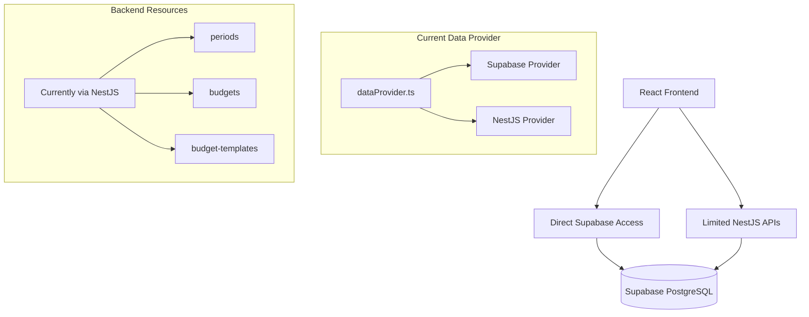
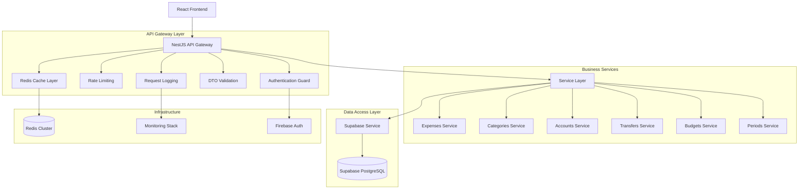

# Account v2 API Gateway Migration Strategy
**Version 1.0**  
Account v2 Development Team  
January 2026

> **Comprehensive migration strategy for replacing direct Supabase access with a complete NestJS API Gateway solution**

---

## 📋 Executive Summary

Account v2 currently operates on a hybrid architecture with direct Supabase client access and limited NestJS backend services. This strategy outlines a complete migration to a unified NestJS API Gateway that will provide enhanced security, performance, and scalability while maintaining backward compatibility during the transition.

### Key Objectives
- **Complete API Coverage**: All frontend data access through NestJS
- **Performance Optimization**: Multi-layer caching with Redis
- **Enhanced Security**: Centralized authentication, rate limiting, validation
- **Scalable Architecture**: Microservices-ready design
- **Smooth Migration**: Zero-downtime transition strategy

---

## 🏗️ Current Architecture Analysis

### Existing State


### Current Issues Identified
1. **Security**: Direct database access from frontend
2. **Performance**: No centralized caching strategy
3. **Consistency**: Multiple data providers with different patterns
4. **Maintainability**: Mixed authentication approaches
5. **Scalability**: Direct database connections limit scaling

### Resources Analysis
| Resource | Current Access | Priority for Migration | Complexity |
|----------|----------------|----------------------|------------|
| periods | NestJS | ✅ Already Migrated | Low |
| budgets | NestJS | ✅ Already Migrated | Low |
| budget-templates | NestJS | ✅ Already Migrated | Low |
| expenses | Supabase Direct | High | High |
| categories | Supabase Direct | High | Medium |
| accounts | Supabase Direct | High | Medium |
| transfers | Supabase Logic | High | High |

---

## 🎯 Target Architecture

### Future State Overview


### Technology Stack
- **API Gateway**: NestJS with Express
- **Authentication**: Firebase Auth + JWT
- **Caching**: Redis Cluster with Multi-tier Strategy
- **Rate Limiting**: NestJS Throttler
- **Validation**: Class-validator & class-transformer
- **Monitoring**: Structured Logging + Metrics
- **Database**: Supabase PostgreSQL (existing)

---

## 📅 Phase-Based Migration Plan

### Phase 1: Foundation & Infrastructure (Weeks 1-2)
**Goal**: Establish core infrastructure and enhanced NestJS foundation

#### Tasks:
1. **Enhanced NestJS Setup**
   - Upgrade to latest NestJS version
   - Configure Redis for caching
   - Implement structured logging
   - Setup health check endpoints

2. **Security Infrastructure**
   - Enhanced Firebase Auth guard
   - Role-based access control (RBAC)
   - API key management for internal services
   - Request validation middleware

3. **Caching Strategy Implementation**
   - Redis cluster setup
   - Cache service enhancement
   - Cache invalidation patterns
   - Performance monitoring

#### Deliverables:
- Enhanced NestJS base application
- Redis caching infrastructure
- Comprehensive authentication system
- Monitoring and logging framework

---

### Phase 2: Core Services Migration (Weeks 3-5)
**Goal**: Migrate high-priority resources to NestJS

#### Accounts Service (Week 3)
```typescript
// Module Structure
@Module({
  imports: [SharedModule, SupabaseModule],
  controllers: [AccountsController],
  providers: [AccountsService],
  exports: [AccountsService],
})
export class AccountsModule {}

// API Endpoints
GET    /accounts              // List accounts
POST   /accounts              // Create account
GET    /accounts/:id          // Get account
PUT    /accounts/:id          // Update account
DELETE /accounts/:id          // Delete account
GET    /accounts/:id/balance  // Get account balance
POST   /accounts/:id/share    // Share account
```

#### Categories Service (Week 4)
```typescript
// Enhanced caching patterns
@CacheKey('categories')
@CacheTTL(300) // 5 minutes
@Get()
async findAll(@Query() query: FindCategoriesDto) {
  return this.categoriesService.findAll(query);
}

// Intelligent cache invalidation
@Post()
async create(@Body() createDto: CreateCategoryDto) {
  const result = await this.categoriesService.create(createDto);
  await this.cacheService.invalidatePattern('categories');
  return result;
}
```

#### Expenses Service (Week 5)
```typescript
// Complex query handling with optimization
@Get()
async findAll(@Query() query: FindExpensesDto) {
  const cacheKey = CacheService.generateKey(
    'expenses', 
    query.accountId, 
    JSON.stringify(query.filter)
  );
  
  return this.cacheService.getOrSet(cacheKey, () => 
    this.expensesService.findAll(query)
  );
}
```

---

### Phase 3: Advanced Features (Weeks 6-7)
**Goal**: Implement complex business logic and optimizations

#### Transfers Service
- Atomic transfer operations
- Complex validation
- Audit logging
- Multi-account support

#### Enhanced Reporting
- Optimized aggregation queries
- Pre-computed reporting data
- Real-time updates via WebSocket
- Export functionality

#### Performance Optimizations
- Database query optimization
- Connection pooling
- Batch operations
- Response compression

---

### Phase 4: Migration & Testing (Weeks 8-9)
**Goal**: Complete migration and ensure system stability

#### Frontend Integration
```typescript
// Updated data provider - unified approach
export const unifiedDataProvider: DataProvider = {
  getList: (resource, params) => {
    return nestDataProvider.getList(resource, params);
  },
  // All methods route through NestJS
};

// Gradual migration with feature flags
const useNestForResource = (resource: string) => {
  const migratedResources = [
    'accounts', 'categories', 'expenses', 
    'transfers', 'periods', 'budgets', 'budget-templates'
  ];
  return migratedResources.includes(resource);
};
```

#### Testing Strategy
- Unit tests for all services
- Integration tests with real database
- Performance testing under load
- Security penetration testing
- Compatibility testing with existing data

---

### Phase 5: Optimization & Monitoring (Weeks 10-12)
**Goal**: Fine-tune performance and establish monitoring

#### Performance Optimization
- Query response time < 200ms
- Cache hit rate > 80%
- Database connection optimization
- CDN integration for static assets

#### Monitoring & Observability
```typescript
// Custom metrics interceptor
@Injectable()
export class MetricsInterceptor implements NestInterceptor {
  intercept(context: ExecutionContext, next: CallHandler): Observable<any> {
    const start = Date.now();
    const request = context.switchToHttp().getRequest();
    
    return next.handle().pipe(
      tap(() => {
        const duration = Date.now() - start;
        this.metricsService.recordApiCall(
          request.route.path,
          request.method,
          duration
        );
      })
    );
  }
}
```

---

## 🔧 Technical Specifications

### API Design Patterns

#### 1. RESTful API Standards
```typescript
// Standard response format
interface ApiResponse<T> {
  data: T;
  meta: {
    total?: number;
    page?: number;
    perPage?: number;
    timestamp: string;
  };
  links?: {
    self?: string;
    next?: string;
    prev?: string;
  };
}

// Error response format
interface ApiError {
  error: {
    code: string;
    message: string;
    details?: any;
    timestamp: string;
    requestId: string;
  };
}
```

#### 2. Validation with DTOs
```typescript
// Create expense DTO with comprehensive validation
export class CreateExpenseDto {
  @IsNotEmpty()
  @IsString()
  @MaxLength(255)
  description: string;

  @IsNotEmpty()
  @IsNumber()
  @Min(0)
  amount: number;

  @IsNotEmpty()
  @IsDateString()
  date: string;

  @IsUUID()
  @IsOptional()
  category_id?: string;

  @IsUUID()
  @IsNotEmpty()
  account_id: string;

  @IsBoolean()
  @IsOptional()
  reconciled?: boolean;

  @IsString()
  @MaxLength(1000)
  @IsOptional()
  notes?: string;
}
```

#### 3. Caching Strategy
```typescript
// Multi-level caching implementation
@Injectable()
export class EnhancedCacheService {
  // L1: In-memory cache (instant access)
  private l1Cache = new Map<string, CacheEntry>();
  
  // L2: Redis cache (shared across instances)
  constructor(private redisService: RedisService) {}

  async get<T>(key: string): Promise<T | null> {
    // Check L1 first
    const l1Result = this.l1Cache.get(key);
    if (l1Result && !this.isExpired(l1Result)) {
      return l1Result.data;
    }

    // Check L2 (Redis)
    const l2Result = await this.redisService.get(key);
    if (l2Result) {
      // Populate L1 for future access
      this.l1Cache.set(key, {
        data: l2Result,
        timestamp: Date.now(),
        ttl: 60000 // 1 minute
      });
      return l2Result;
    }

    return null;
  }
}
```

### Security Implementation

#### 1. Authentication Flow
```typescript
@Injectable()
export class EnhancedAuthGuard implements CanActivate {
  async canActivate(context: ExecutionContext): Promise<boolean> {
    const request = context.switchToHttp().getRequest();
    const token = this.extractToken(request);
    
    if (!token) {
      throw new UnauthorizedException('Missing authentication token');
    }

    try {
      // Verify JWT token
      const decoded = await this.firebaseService.verifyToken(token);
      
      // Check rate limits
      await this.rateLimitService.checkLimit(decoded.uid);
      
      // Attach user and permissions
      request.user = decoded;
      request.permissions = await this.permissionsService.getUserPermissions(decoded.uid);
      
      return true;
    } catch (error) {
      throw new UnauthorizedException('Invalid authentication token');
    }
  }
}
```

#### 2. Rate Limiting
```typescript
@Injectable()
export class RateLimitService {
  constructor(private redisService: RedisService) {}

  async checkLimit(userId: string, endpoint: string): Promise<void> {
    const key = `rate_limit:${userId}:${endpoint}`;
    const limit = 100; // requests per hour
    const window = 3600; // 1 hour in seconds

    const current = await this.redisService.incr(key);
    
    if (current === 1) {
      await this.redisService.expire(key, window);
    }

    if (current > limit) {
      throw new ThrottlerException('Rate limit exceeded');
    }
  }
}
```

### Database Optimization

#### 1. Query Optimization
```typescript
@Injectable()
export class ExpensesService {
  // Optimized expense listing with proper indexing
  async findAll(query: FindExpensesDto): Promise<PaginatedResponse<Expense>> {
    const { accountId, page = 1, perPage = 25, filters } = query;
    
    // Use database indexes effectively
    let dbQuery = this.supabaseClient
      .from('expenses')
      .select('*', { count: 'exact' })
      .eq('account_id', accountId)
      .order('date', { ascending: false });

    // Apply filters efficiently
    if (filters?.category_id) {
      dbQuery = dbQuery.eq('category_id', filters.category_id);
    }
    
    if (filters?.date_gte) {
      dbQuery = dbQuery.gte('date', filters.date_gte);
    }

    // Pagination
    const from = (page - 1) * perPage;
    const to = from + perPage - 1;
    dbQuery = dbQuery.range(from, to);

    return dbQuery;
  }
}
```

#### 2. Connection Pooling
```typescript
// Supabase client with connection optimization
@Injectable()
export class OptimizedSupabaseService {
  private client: SupabaseClient;

  constructor() {
    this.client = createClient(
      process.env.SUPABASE_URL,
      process.env.SUPABASE_SERVICE_KEY,
      {
        db: {
          schema: 'public',
        },
        auth: {
          persistSession: false,
        },
        global: {
          headers: {
            'Connection': 'keep-alive',
          },
        },
      }
    );
  }
}
```

---

## 🚀 Implementation Roadmap

### Sprint Planning (12-Week Timeline)

| Sprint | Duration | Key Deliverables |
|--------|----------|------------------|
| Sprint 1 | Week 1-2 | Enhanced NestJS foundation, Redis setup, Auth system |
| Sprint 2 | Week 3-4 | Accounts & Categories services migration |
| Sprint 3 | Week 5-6 | Expenses service with advanced filtering |
| Sprint 4 | Week 7-8 | Transfers service and complex business logic |
| Sprint 5 | Week 9-10 | Frontend integration and testing |
| Sprint 6 | Week 11-12 | Performance optimization and monitoring |

### Critical Path Analysis

**Must-Have Dependencies:**
1. Redis cluster setup (Week 1)
2. Enhanced authentication system (Week 1-2)
3. Base service patterns (Week 2)

**Parallel Development Opportunities:**
- Frontend data provider updates can happen alongside backend development
- Monitoring infrastructure can be developed independently
- Test suite can be built incrementally

### Resource Requirements

#### Team Skills Needed:
- **Backend Developer**: NestJS, TypeScript, PostgreSQL
- **DevOps Engineer**: Redis, Firebase, Cloud deployment
- **Frontend Developer**: React, TypeScript, API integration
- **QA Engineer**: Testing strategy, performance testing

#### Tooling Requirements:
```json
{
  "development": {
    "nestjs/cli": "^10.0.0",
    "redis/om": "^0.3.0",
    "class-validator": "^0.14.0",
    "swagger": "^5.0.0"
  },
  "infrastructure": {
    "redis": "^7.0.0",
    "firebase-admin": "^11.0.0",
    "supabase": "^2.0.0"
  },
  "monitoring": {
    "winston": "^3.0.0",
    "prometheus": "^14.0.0",
    "newrelic": "^9.0.0"
  }
}
```

---

## ⚠️ Risk Assessment & Mitigation

### High-Risk Areas

#### 1. Data Migration Complexity
**Risk**: Data loss or inconsistency during migration
**Mitigation**:
- Implement comprehensive backup strategy
- Use transaction-based migration scripts
- Perform migration in stages with rollback capability
- Validate data integrity at each step

#### 2. Performance Regression
**Risk**: New API layer introduces latency
**Mitigation**:
- Implement aggressive caching strategy
- Optimize database queries with proper indexing
- Use connection pooling
- Monitor performance metrics continuously

#### 3. Authentication Issues
**Risk**: Users unable to access accounts during transition
**Mitigation**:
- Maintain backward compatibility during transition
- Test authentication flows thoroughly
- Implement gradual rollout with feature flags
- Have rollback plan ready

### Medium-Risk Areas

#### 1. Cache Invalidation
**Risk**: Stale data being served
**Mitigation**:
- Implement intelligent cache invalidation
- Use cache versioning strategy
- Monitor cache hit/miss ratios
- Provide manual cache refresh endpoints

#### 2. Rate Limiting Impact
**Risk**: Legitimate users blocked
**Mitigation**:
- Implement progressive rate limiting
- Provide rate limit headers in responses
- Allow rate limit increases for verified accounts
- Monitor false positive rates

### Contingency Planning

#### Rollback Strategy
```typescript
// Feature flag system for gradual migration
@Injectable()
export class MigrationFeatureFlag {
  async useNestJSForResource(resource: string, userId: string): Promise<boolean> {
    // Gradual rollout based on user percentage
    const rolloutPercentage = await this.getRolloutPercentage(resource);
    const userHash = this.hashUserId(userId);
    return (userHash % 100) < rolloutPercentage;
  }
}
```

#### Monitoring Alerts
```typescript
// Health check endpoints for monitoring
@Controller('health')
export class HealthController {
  @Get()
  async healthCheck(): Promise<HealthStatus> {
    return {
      status: 'healthy',
      timestamp: new Date().toISOString(),
      services: {
        database: await this.checkDatabase(),
        redis: await this.checkRedis(),
        authentication: await this.checkAuth(),
      },
      metrics: await this.getMetrics(),
    };
  }
}
```

---

## 📊 Success Metrics & KPIs

### Performance Metrics
- **API Response Time**: < 200ms (95th percentile)
- **Cache Hit Rate**: > 80%
- **Database Query Time**: < 50ms average
- **Error Rate**: < 0.1%
- **Uptime**: > 99.9%

### Security Metrics
- **Authentication Success Rate**: > 99.5%
- **Rate Limiting Effectiveness**: Zero successful attacks
- **Vulnerability Scan Results**: Zero critical vulnerabilities
- **Data Breach Incidents**: Zero

### Development Metrics
- **Code Coverage**: > 90%
- **Build Success Rate**: 100%
- **Test Pass Rate**: > 95%
- **Documentation Coverage**: 100% for public APIs

---

## 🔄 Post-Migration Optimization

### Phase 6: Advanced Features (Weeks 13-16)
1. **Real-time Updates**: WebSocket implementation
2. **Advanced Analytics**: Pre-computed reporting data
3. **Machine Learning Integration**: Expense categorization AI
4. **Mobile API Optimization**: Reduced payload sizes

### Phase 7: Scaling Preparation (Weeks 17-20)
1. **Microservices Architecture**: Service decomposition
2. **Event-Driven Architecture**: Message queue implementation
3. **Multi-region Deployment**: Global latency optimization
4. **Advanced Monitoring**: AI-powered anomaly detection

---

## 📚 Documentation & Knowledge Transfer

### Technical Documentation
1. **API Documentation**: Swagger/OpenAPI specifications
2. **Architecture Diagrams**: Current and future state
3. **Deployment Guides**: Step-by-step instructions
4. **Troubleshooting Guides**: Common issues and solutions

### Team Training
1. **NestJS Best Practices**: Coding standards and patterns
2. **Redis Caching**: Cache design and optimization
3. **Security Practices**: Authentication and authorization
4. **Monitoring & Observability**: Metrics and alerting

---

## 🎯 Conclusion

This comprehensive migration strategy provides a structured approach to transforming Account v2 into a modern, scalable, and secure application. By following this phased approach, we can ensure:

- **Zero downtime** during the migration process
- **Enhanced security** through centralized authentication and validation
- **Improved performance** via multi-level caching and optimization
- **Future scalability** through microservices-ready architecture
- **Maintainable codebase** following established patterns and best practices

The success of this migration will establish Account v2 as a robust financial management platform capable of handling growth while maintaining excellent user experience and security standards.

---

**Next Steps:**
1. Review and approve this strategy document
2. Assemble the implementation team
3. Set up development and staging environments
4. Begin Phase 1 implementation
5. Establish regular progress review cadence

**Document Version**: 1.0  
**Last Updated**: January 24, 2026  
**Next Review**: February 7, 2026